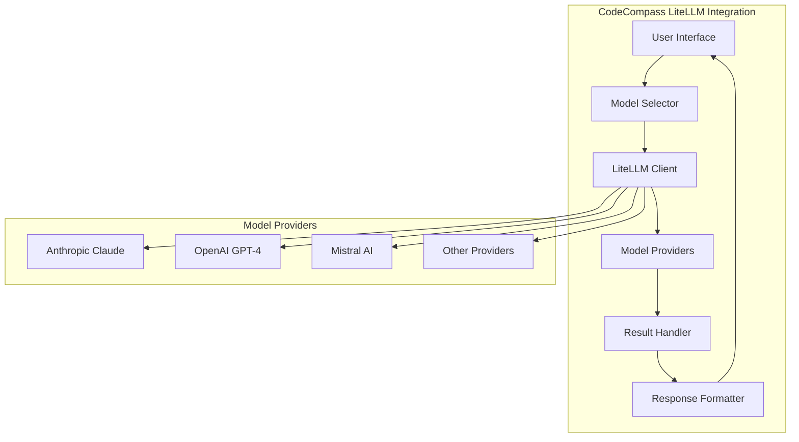

# LiteLLM Integration for CodeCompass

This document outlines the design and implementation details for integrating LiteLLM with CodeCompass, enabling users to work with multiple Large Language Models (LLMs) through a unified interface.

## Overview

LiteLLM provides a standardized interface for working with various LLM providers, including Anthropic (Claude), OpenAI (GPT models), Mistral AI, and others. By integrating LiteLLM into CodeCompass, we enable users to:

1. **Choose the optimal model** for specific code understanding tasks
2. **Compare results** across different models
3. **Optimize costs** by selecting appropriate models for different needs
4. **Create fallback mechanisms** when a primary model is unavailable

## Architecture

The LiteLLM integration in CodeCompass consists of three primary components:

1. **Core Client**: A Python-based client that handles model selection, API authentication, and request formatting
2. **CLI Tool**: A command-line interface for interacting with the LiteLLM Client
3. **Web Interface**: A React-based interface for model comparison and visualization

### System Architecture Diagram



## Implementation

### Core LiteLLM Client

The core client is responsible for handling communication with different LLM providers through LiteLLM.

```python
# codecompass/litellm_client.py

import os
import json
import time
from typing import Dict, List, Optional, Union, Any
import litellm
from litellm import completion

class CodeCompassLiteLLMClient:
    """
    Client for interacting with multiple LLMs via LiteLLM.
    """
    
    def __init__(self, config_path: Optional[str] = None):
        """
        Initialize the LiteLLM client with configuration.
        
        Args:
            config_path (str, optional): Path to configuration file
        """
        self.config = self._load_config(config_path)
        self._setup_providers()
        
    def _load_config(self, config_path: Optional[str]) -> Dict[str, Any]:
        """Load configuration from file or use defaults."""
        default_config = {
            "default_model": "claude-3-sonnet-20240229",
            "providers": {
                "anthropic": {
                    "api_key_env": "ANTHROPIC_API_KEY",
                    "models": ["claude-3-opus-20240229", "claude-3-sonnet-20240229", "claude-3-haiku-20240307"]
                },
                "openai": {
                    "api_key_env": "OPENAI_API_KEY",
                    "models": ["gpt-4-turbo", "gpt-4", "gpt-3.5-turbo"]
                },
                "mistral": {
                    "api_key_env": "MISTRAL_API_KEY",
                    "models": ["mistral-large", "mistral-medium", "mistral-small"]
                }
            },
            "max_tokens": 4096,
            "temperature": 0.7
        }
        
        if not config_path:
            return default_config
            
        try:
            with open(config_path, 'r') as f:
                user_config = json.load(f)
                # Merge with defaults
                for key, value in user_config.items():
                    if key in default_config and isinstance(value, dict) and isinstance(default_config[key], dict):
                        default_config[key].update(value)
                    else:
                        default_config[key] = value
                return default_config
        except (FileNotFoundError, json.JSONDecodeError) as e:
            print(f"Error loading config: {str(e)}. Using defaults.")
            return default_config
    
    def _setup_providers(self):
        """Configure LiteLLM with provider API keys from environment variables."""
        for provider, settings in self.config["providers"].items():
            api_key_env = settings.get("api_key_env")
            if api_key_env and api_key_env in os.environ:
                # Set the API key in litellm's expected environment variable format
                if provider == "anthropic":
                    os.environ["ANTHROPIC_API_KEY"] = os.environ[api_key_env]
                elif provider == "openai":
                    os.environ["OPENAI_API_KEY"] = os.environ[api_key_env]
                elif provider == "mistral":
                    os.environ["MISTRAL_API_KEY"] = os.environ[api_key_env]
    
    def get_available_models(self) -> List[Dict[str, str]]:
        """
        Get list of available models based on configured API keys.
        
        Returns:
            List[Dict[str, str]]: List of available models with provider and name
        """
        available_models = []
        
        for provider, settings in self.config["providers"].items():
            api_key_env = settings.get("api_key_env")
            if api_key_env and api_key_env in os.environ:
                for model in settings.get("models", []):
                    available_models.append({
                        "provider": provider,
                        "name": model,
                        "full_name": f"{provider}/{model}"
                    })
        
        return available_models
    
    def process_code(self, 
                     code: str, 
                     model: Optional[str] = None, 
                     prompt_template: Optional[str] = None,
                     system_prompt: Optional[str] = None,
                     **kwargs) -> Dict[str, Any]:
        """
        Process code using the specified model.
        
        Args:
            code (str): The code to process
            model (str, optional): Model to use (default from config if not specified)
            prompt_template (str, optional): Template for formatting the prompt
            system_prompt (str, optional): System prompt to guide the model
            **kwargs: Additional parameters to pass to the model
            
        Returns:
            Dict[str, Any]: Model response with additional metadata
        """
        if not model:
            model = self.config["default_model"]
        
        # Default system prompt for code understanding if not provided
        if not system_prompt:
            system_prompt = (
                "You are an expert programmer assistant. Analyze the provided code carefully. "
                "Provide concise, accurate, and helpful responses about the code."
            )
        
        # Default prompt template if not provided
        if not prompt_template:
            prompt_template = "Please analyze the following code:\n\n{code}"
        
        formatted_prompt = prompt_template.format(code=code)
        
        # Parameters for the request
        params = {
            "model": model,
            "messages": [
                {"role": "system", "content": system_prompt},
                {"role": "user", "content": formatted_prompt}
            ],
            "max_tokens": kwargs.get("max_tokens", self.config["max_tokens"]),
            "temperature": kwargs.get("temperature", self.config["temperature"])
        }
        
        # Track metrics for the request
        start_time = time.time()
        
        try:
            response = litellm.completion(**params)
            
            # Process the response
            duration = time.time() - start_time
            
            result = {
                "model": model,
                "content": response.choices[0].message.content,
                "metrics": {
                    "duration_seconds": duration,
                    "tokens": {
                        "prompt": response.usage.prompt_tokens,
                        "completion": response.usage.completion_tokens,
                        "total": response.usage.total_tokens
                    }
                },
                "raw_response": response
            }
            
            return result
            
        except Exception as e:
            # Handle errors
            duration = time.time() - start_time
            return {
                "model": model,
                "error": str(e),
                "metrics": {
                    "duration_seconds": duration
                }
            }
    
    def compare_models(self, 
                       code: str, 
                       models: List[str], 
                       prompt_template: Optional[str] = None,
                       system_prompt: Optional[str] = None,
                       **kwargs) -> Dict[str, Any]:
        """
        Compare code processing across multiple models.
        
        Args:
            code (str): The code to process
            models (List[str]): List of models to compare
            prompt_template (str, optional): Template for formatting the prompt
            system_prompt (str, optional): System prompt to guide the models
            **kwargs: Additional parameters to pass to the models
            
        Returns:
            Dict[str, Any]: Comparison results for each model
        """
        results = {}
        
        for model in models:
            results[model] = self.process_code(
                code, 
                model=model,
                prompt_template=prompt_template,
                system_prompt=system_prompt,
                **kwargs
            )
        
        return results
```

### Command Line Interface

The CLI provides a user-friendly way to interact with the LiteLLM integration from the terminal.

```python
# codecompass/cli.py

import os
import sys
import argparse
import json
from typing import List, Optional, Dict, Any
from .litellm_client import CodeCompassLiteLLMClient

def get_file_content(file_path: str) -> str:
    """Read content from a file."""
    try:
        with open(file_path, 'r', encoding='utf-8') as f:
            return f.read()
    except Exception as e:
        print(f"Error reading file {file_path}: {str(e)}")
        sys.exit(1)

def get_directory_content(dir_path: str, extensions: Optional[List[str]] = None) -> Dict[str, str]:
    """Read content from all files in a directory with specified extensions."""
    result = {}
    
    if not extensions:
        extensions = ['.py', '.js', '.ts', '.jsx', '.tsx', '.java', '.c', '.cpp', '.h', '.md']
    
    for root, _, files in os.walk(dir_path):
        for file in files:
            if any(file.endswith(ext) for ext in extensions):
                file_path = os.path.join(root, file)
                rel_path = os.path.relpath(file_path, dir_path)
                try:
                    with open(file_path, 'r', encoding='utf-8') as f:
                        result[rel_path] = f.read()
                except Exception as e:
                    print(f"Warning: Could not read {file_path}: {str(e)}")
    
    return result

def main():
    """Main entry point for the CLI."""
    parser = argparse.ArgumentParser(description="CodeCompass LiteLLM CLI")
    
    # Command subparsers
    subparsers = parser.add_subparsers(dest="command", help="Command to execute")
    
    # List models command
    list_parser = subparsers.add_parser("list-models", help="List available models")
    
    # Process file command
    process_parser = subparsers.add_parser("process", help="Process code with a model")
    process_parser.add_argument("input", help="File or directory to process")
    process_parser.add_argument("--model", "-m", help="Model to use")
    process_parser.add_argument("--query", "-q", help="Query or instruction for the model")
    process_parser.add_argument("--output", "-o", help="Output file for the results")
    process_parser.add_argument("--config", "-c", help="Path to configuration file")
    
    # Compare models command
    compare_parser = subparsers.add_parser("compare", help="Compare models on the same input")
    compare_parser.add_argument("input", help="File or directory to process")
    compare_parser.add_argument("--models", "-m", nargs="+", required=True, help="Models to compare")
    compare_parser.add_argument("--query", "-q", help="Query or instruction for the models")
    compare_parser.add_argument("--output", "-o", help="Output file for the results")
    compare_parser.add_argument("--config", "-c", help="Path to configuration file")
    
    # Parse arguments
    args = parser.parse_args()
    
    # Create the client
    config_path = args.config if hasattr(args, "config") and args.config else None
    client = CodeCompassLiteLLMClient(config_path)
    
    # Execute commands
    if args.command == "list-models":
        models = client.get_available_models()
        print("Available models:")
        for model in models:
            print(f"  - {model['full_name']}")
    
    elif args.command == "process":
        # Get the input content
        if os.path.isfile(args.input):
            content = get_file_content(args.input)
            input_type = "file"
        elif os.path.isdir(args.input):
            content = json.dumps(get_directory_content(args.input), indent=2)
            input_type = "directory"
        else:
            print(f"Error: Input {args.input} is not a valid file or directory")
            sys.exit(1)
        
        # Prepare prompt template
        if args.query:
            prompt_template = args.query + "\n\n{code}"
        else:
            if input_type == "file":
                prompt_template = "Please analyze the following code and provide insights:\n\n{code}"
            else:
                prompt_template = "Please analyze the following codebase and provide insights:\n\n{code}"
        
        # Process the content
        result = client.process_code(
            content,
            model=args.model,
            prompt_template=prompt_template
        )
        
        # Output the result
        if args.output:
            with open(args.output, 'w', encoding='utf-8') as f:
                json.dump(result, f, indent=2)
        else:
            print("\nModel:", result["model"])
            if "error" in result:
                print("\nError:", result["error"])
            else:
                print("\nResponse:")
                print(result["content"])
                print("\nMetrics:")
                print(f"  Time: {result['metrics']['duration_seconds']:.2f} seconds")
                if "tokens" in result["metrics"]:
                    print(f"  Tokens: {result['metrics']['tokens']['total']} total")
    
    elif args.command == "compare":
        # Get the input content
        if os.path.isfile(args.input):
            content = get_file_content(args.input)
            input_type = "file"
        elif os.path.isdir(args.input):
            content = json.dumps(get_directory_content(args.input), indent=2)
            input_type = "directory"
        else:
            print(f"Error: Input {args.input} is not a valid file or directory")
            sys.exit(1)
        
        # Prepare prompt template
        if args.query:
            prompt_template = args.query + "\n\n{code}"
        else:
            if input_type == "file":
                prompt_template = "Please analyze the following code and provide insights:\n\n{code}"
            else:
                prompt_template = "Please analyze the following codebase and provide insights:\n\n{code}"
        
        # Compare models
        results = client.compare_models(
            content,
            models=args.models,
            prompt_template=prompt_template
        )
        
        # Output the results
        if args.output:
            with open(args.output, 'w', encoding='utf-8') as f:
                json.dump(results, f, indent=2)
        else:
            for model, result in results.items():
                print("\n" + "="*50)
                print(f"Model: {model}")
                print("="*50 + "\n")
                
                if "error" in result:
                    print("Error:", result["error"])
                else:
                    print("Response:")
                    print(result["content"])
                    print("\nMetrics:")
                    print(f"  Time: {result['metrics']['duration_seconds']:.2f} seconds")
                    if "tokens" in result["metrics"]:
                        print(f"  Tokens: {result['metrics']['tokens']['total']} total")
    
    else:
        parser.print_help()

if __name__ == "__main__":
    main()
```

### Web Interface Components

The web interface will provide interactive components for working with multiple models. Here's a sample React component for the model selector:

```jsx
// src/components/ModelSelector.jsx

import React, { useState, useEffect } from 'react';
import { fetchAvailableModels } from '../api/modelsApi';

const ModelSelector = ({ onModelSelect, selectedModel, title = "Select a Model" }) => {
  const [models, setModels] = useState([]);
  const [loading, setLoading] = useState(true);
  const [error, setError] = useState(null);
  const [groupedModels, setGroupedModels] = useState({});

  useEffect(() => {
    const loadModels = async () => {
      try {
        setLoading(true);
        const availableModels = await fetchAvailableModels();
        setModels(availableModels);
        
        // Group models by provider
        const grouped = availableModels.reduce((acc, model) => {
          if (!acc[model.provider]) {
            acc[model.provider] = [];
          }
          acc[model.provider].push(model);
          return acc;
        }, {});
        
        setGroupedModels(grouped);
        setLoading(false);
      } catch (err) {
        setError('Failed to load models. Please check your API keys.');
        setLoading(false);
      }
    };
    
    loadModels();
  }, []);

  if (loading) {
    return <div className="model-selector-loading">Loading available models...</div>;
  }

  if (error) {
    return <div className="model-selector-error">{error}</div>;
  }

  return (
    <div className="model-selector">
      <h3>{title}</h3>
      {Object.entries(groupedModels).map(([provider, providerModels]) => (
        <div key={provider} className="model-provider-group">
          <h4>{provider.charAt(0).toUpperCase() + provider.slice(1)}</h4>
          <div className="model-list">
            {providerModels.map(model => (
              <div 
                key={model.full_name} 
                className={`model-item ${selectedModel === model.full_name ? 'selected' : ''}`}
                onClick={() => onModelSelect(model.full_name)}
              >
                <div className="model-name">{model.name}</div>
                <div className="model-provider">{model.provider}</div>
              </div>
            ))}
          </div>
        </div>
      ))}
    </div>
  );
};

export default ModelSelector;
```

Here's another component for comparing model responses:

```jsx
// src/components/ModelComparison.jsx

import React, { useState } from 'react';
import ModelSelector from './ModelSelector';
import CodeEditor from './CodeEditor';
import { compareModels } from '../api/modelsApi';

const ModelComparison = () => {
  const [code, setCode] = useState('');
  const [query, setQuery] = useState('');
  const [selectedModels, setSelectedModels] = useState([]);
  const [results, setResults] = useState({});
  const [loading, setLoading] = useState(false);
  const [error, setError] = useState(null);

  const toggleModelSelection = (modelName) => {
    if (selectedModels.includes(modelName)) {
      setSelectedModels(selectedModels.filter(m => m !== modelName));
    } else {
      setSelectedModels([...selectedModels, modelName]);
    }
  };

  const handleCompare = async () => {
    if (selectedModels.length === 0) {
      setError('Please select at least one model to compare');
      return;
    }
    
    if (!code.trim()) {
      setError('Please enter some code to analyze');
      return;
    }
    
    try {
      setLoading(true);
      setError(null);
      
      const comparisonResults = await compareModels(code, selectedModels, query);
      setResults(comparisonResults);
      
      setLoading(false);
    } catch (err) {
      setError('Failed to compare models: ' + err.message);
      setLoading(false);
    }
  };

  return (
    <div className="model-comparison">
      <div className="comparison-controls">
        <h2>Compare Models</h2>
        
        <div className="code-input-section">
          <h3>Code to Analyze</h3>
          <CodeEditor
            value={code}
            onChange={setCode}
            language="javascript"
            height="300px"
          />
        </div>
        
        <div className="query-input-section">
          <h3>Query (Optional)</h3>
          <textarea
            value={query}
            onChange={(e) => setQuery(e.target.value)}
            placeholder="Ask a specific question about the code..."
            className="query-input"
          />
        </div>
        
        <div className="model-selection-section">
          <ModelSelector 
            onModelSelect={toggleModelSelection}
            selectedModels={selectedModels}
            multiSelect={true}
            title="Select Models to Compare"
          />
        </div>
        
        <button 
          onClick={handleCompare} 
          disabled={loading || selectedModels.length === 0 || !code.trim()}
          className="compare-button"
        >
          {loading ? 'Comparing...' : 'Compare Models'}
        </button>
        
        {error && <div className="error-message">{error}</div>}
      </div>
      
      {Object.keys(results).length > 0 && (
        <div className="comparison-results">
          <h2>Comparison Results</h2>
          
          <div className="results-grid">
            {selectedModels.map(model => (
              <div key={model} className="model-result-card">
                <h3>{model}</h3>
                
                {results[model]?.error ? (
                  <div className="error-message">{results[model].error}</div>
                ) : (
                  <>
                    <div className="response-content">
                      <pre>{results[model]?.content}</pre>
                    </div>
                    
                    <div className="metrics">
                      <div className="metric">
                        <span>Time:</span> {results[model]?.metrics?.duration_seconds.toFixed(2)}s
                      </div>
                      {results[model]?.metrics?.tokens && (
                        <div className="metric">
                          <span>Tokens:</span> {results[model]?.metrics?.tokens?.total}
                        </div>
                      )}
                    </div>
                  </>
                )}
              </div>
            ))}
          </div>
        </div>
      )}
    </div>
  );
};

export default ModelComparison;
```

## Usage Examples

### CLI Usage Examples

```bash
# List all available models
codecompass list-models

# Process a single file with the default model
codecompass process path/to/file.py

# Process a file with a specific model and query
codecompass process path/to/file.py --model anthropic/claude-3-sonnet-20240229 --query "Explain this code and suggest improvements"

# Compare multiple models on the same file
codecompass compare path/to/file.py --models anthropic/claude-3-sonnet-20240229 openai/gpt-4 mistral/mistral-large

# Process a directory with a specific model and save output
codecompass process path/to/project --model anthropic/claude-3-opus-20240229 --output analysis.json
```

### Python API Usage Examples

```python
from codecompass.litellm_client import CodeCompassLiteLLMClient

# Initialize the client
client = CodeCompassLiteLLMClient()

# Get available models
models = client.get_available_models()
print(f"Available models: {[m['full_name'] for m in models]}")

# Process code with a specific model
code = """
def factorial(n):
    if n <= 1:
        return 1
    return n * factorial(n-1)
"""

result = client.process_code(
    code,
    model="anthropic/claude-3-sonnet-20240229",
    prompt_template="Explain this code and suggest any potential improvements:\n\n{code}"
)

print(result["content"])

# Compare multiple models
comparison = client.compare_models(
    code,
    models=["anthropic/claude-3-sonnet-20240229", "openai/gpt-4", "mistral/mistral-large"],
    prompt_template="What's the time complexity of this function? Explain your reasoning:\n\n{code}"
)

for model, result in comparison.items():
    print(f"\n{model} response:")
    print(result["content"])
```

## API Reference

### Client Methods

| Method | Description |
|--------|-------------|
| `get_available_models()` | Returns list of available models based on configured API keys |
| `process_code(code, model, prompt_template, system_prompt, **kwargs)` | Process code using the specified model |
| `compare_models(code, models, prompt_template, system_prompt, **kwargs)` | Compare code processing across multiple models |

### CLI Commands

| Command | Description |
|---------|-------------|
| `list-models` | List all available models |
| `process <input>` | Process code with a model |
| `compare <input>` | Compare models on the same input |

## Future Improvements

1. **Advanced Response Comparison**:
   - Add semantic similarity measures between responses
   - Compare code suggestions and refactorings
   - Highlight differences between model responses

2. **Cost Optimization**:
   - Add cost estimation for each model
   - Implement smart model selection based on task complexity

3. **Performance Benchmarking**:
   - Create standardized test cases
   - Generate performance reports across models

4. **Streaming Support**:
   - Implement response streaming for better UX
   - Add interactive follow-up questions

5. **Custom Routing and Fallbacks**:
   - Route specific queries to specialized models
   - Implement automatic failover to alternative models 