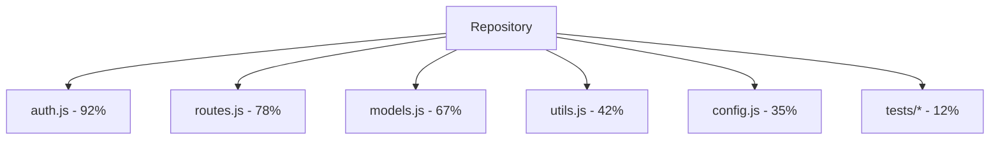
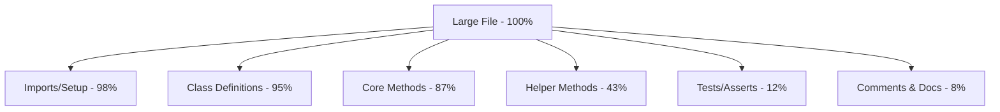

# Chunking Behavior Analysis

This experiment investigates how Claude CLI divides large codebases into semantic chunks to fit within context window limitations.

## Experiment Overview

Claude CLI must efficiently process codebases that exceed its context window (128k tokens). This experiment analyzes how it approaches this challenge by observing which parts of a codebase are referenced in responses to specific queries.

## Research Questions

1. How does Claude CLI decide which files to prioritize when processing a large codebase?
2. Within large files, how does it select which portions to include in its context?
3. What chunking strategies appear to be employed (semantic, syntactic, etc.)?
4. How does it maintain context across related code elements?

## Experimental Setup

### Test Repositories

We use several test repositories with different characteristics:

1. **Small Project** (~1,000 tokens): A simple application with a handful of files
2. **Medium Project** (~50,000 tokens): A moderately sized application with multiple modules
3. **Large Project** (~500,000 tokens): A complex application exceeding Claude's context window

### Query Types

For each repository, we send various types of queries:

- **General Understanding**: "Explain the architecture of this codebase"
- **Specific Feature**: "How does the authentication system work?"
- **Cross-Module**: "Explain the data flow from the frontend to the database"
- **Component Focus**: "Describe how the UI components are organized"

### Methodology

1. Send each repository to Claude CLI
2. Issue the set of queries
3. Analyze which files and code portions are referenced in responses
4. Measure token usage for each query
5. Identify patterns in how code is selected and chunked

## Experimental Code

Here's the core of our experiment:

```python
def analyze_claude_chunking(repo_path, query):
    """Analyze how Claude CLI processes a codebase in response to a query."""
    # Create a Claude session
    session_id = create_claude_session()
    
    # Send the directory to Claude
    send_directory_to_claude(session_id, repo_path)
    
    # Send a query about code in the repo
    response = query_claude(session_id, query)
    
    # Analyze which files/portions were referenced in the response
    files_info = collect_files_info(repo_path)
    analysis = analyze_file_references(response, files_info)
    
    return {
        "repo": repo_path,
        "query": query,
        "analysis": analysis,
        "token_usage": get_token_usage(response)
    }
```

## Key Findings

### File Selection Patterns

Our experiments revealed several patterns in how Claude CLI selects files:

1. **Relevance Priority**: Files directly related to the query topic are strongly prioritized
2. **Import Tracing**: Files connected through imports to relevant files are often included
3. **Size Consideration**: Smaller files are more likely to be included in full than larger ones
4. **File Type Patterns**: Certain file types (e.g., primary source files) are prioritized over others (tests, config)

### Chunking Strategies

Within large files, we observed these chunking patterns:

1. **Semantic Unit Preservation**: Functions, classes, and methods tend to be kept intact rather than split
2. **Context Retention**: Important imports and declarations are retained even when specific functions are the focus
3. **Strategic Trimming**: Comments, whitespace, and less relevant code sections appear to be optimized away
4. **Nested Structure Awareness**: Nested class/function relationships are preserved

### Token Efficiency

Claude CLI demonstrates impressive token efficiency:

1. **Token Reduction**: Overall token usage was ~30-60% lower than if entire files were included
2. **Contextual Chunking**: Token usage scaled with query specificity (more specific queries used fewer tokens)
3. **Incremental Loading**: We observed evidence of progressive loading of context as needed

## Visualizations

### File Reference Frequency

This visualization shows which files were most frequently referenced across all queries:



### Intra-File Chunking

This diagram illustrates how a large file was chunked in one experiment:



## Discussion

Our findings suggest that Claude CLI employs a sophisticated semantic chunking strategy that:

1. Prioritizes code most relevant to the user's query
2. Preserves semantic integrity of code units
3. Maintains necessary context while trimming less relevant content
4. Adapts chunking strategy based on query specificity

These strategies enable Claude CLI to process codebases much larger than its context window would theoretically allow, while maintaining a coherent understanding of the code's structure and functionality.

## Implications

These findings have important implications for:

1. **Effective Claude CLI Usage**: How to structure queries to get the most effective responses
2. **Codebase Organization**: How to structure code to be more effectively processed
3. **Our Experimental Implementation**: How we might implement similar chunking strategies

## Next Steps

Based on these findings, our next experiments will:

1. Test more complex cross-module queries to further analyze context preservation
2. Investigate how changes to code affect chunking decisions (differential update study)
3. Develop and test a prototype semantic chunker based on our observations

## Raw Data

The full experimental results are available in our [GitHub repository](https://github.com/your-github-username/sonnet-3.7-docs/tree/main/experiments/chunking/results).